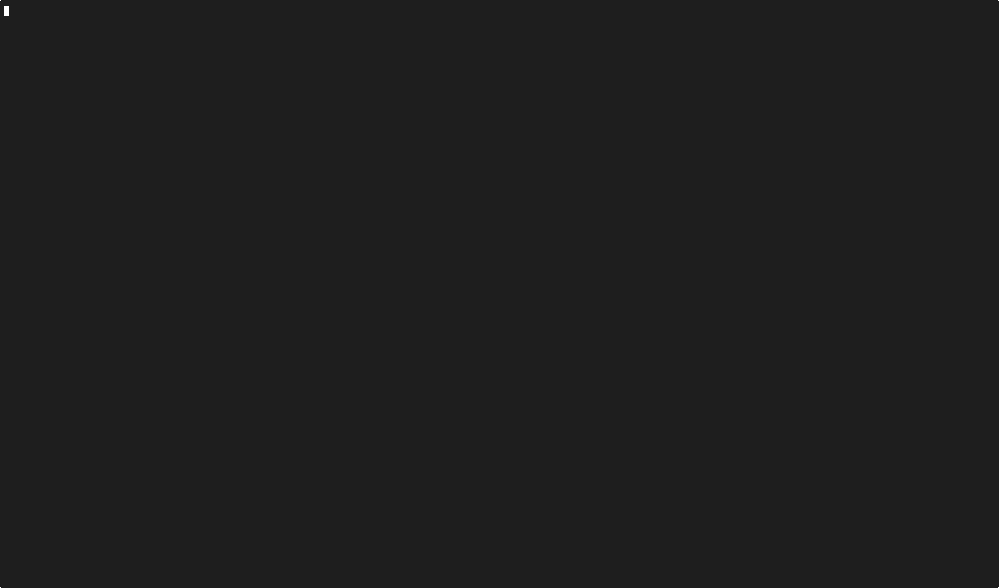

# A context-based autocompletion plugin for the Fish shell

based.fish is a lightweight Fish plugin that provides context-based autocompletion for commands, options, and arguments. It enhances the default Fish shell completion system by offering more intelligent and context-aware suggestions. For example, it suggests commands based on the frequency of use, date of use, and the context of the current command line such as the path where you are, the command you are typing, etc. See the [other tools](#other-tools) section for a comparison with similar tools.

## Features

- Context-aware autocompletion for commands, options, and arguments.
- Supports combining different history sources, such as the current working directory, the global suggestions, and the previous command.
- Directory-aware completions that take into account the current working directory.
- Integration with fzf for a better selection experience.
- Easy installation and setup with Fisher.
- Support for importing existing Fish history.
- Customizable configuration options to tailor the behavior of the plugin.
- Statistics about command usage, such as most frequently used commands, options, and arguments.
- Customizable keybindings for navigating and selecting completions.
- Support for disabling fuzzy matching and confirmation prompts.

## How it works

based.fish uses a SQLite database to store command history and statistics. It analyzes the command history to provide context-aware suggestions based on the current command line input or simply based on the current working directory. The logic is as follows:

- It tracks the frequency of commands, options, and arguments used in the past.
- It tracks the working directory where the commands were executed.
- Smart suggestions are created with that information.
- fzf is used for fuzzy matching and selection of completions.
- It provides a user-friendly interface for navigating and selecting completions.

### Suggestions algorithm

- It considers the date of the last use, the frequency of use, and the context of the current command line input. Suggestions are made based on this information.
- If you are in a directory where you have previously used a command multiple times, it will suggest that command first, then the second most used command, and so on.
- For convenience, during the current session, it will always suggest your previous command first and then append the most used commands in the current directory, and then then global ones. It's to replicate the "normal" behavior of most shells.


## Installation

You can install based.fish using Fisher, a plugin manager for Fish shell. Run the following command:

```fish
$ fisher install Edu4rdSHL/based.fish
```

## Requirements

- fzf: for selection of completions.
- sqlite3: for storing and querying command history.

## Usage

Make sure to initialize the plugin once installed:

```fish
$ based init
```
This will set up the necessary database and configuration files.

You can also import your existing Fish history into the based.fish database:

```fish
$ based import
```
This will read your existing Fish history and populate the based.fish database with it.

Additionally, you can see the stats of your command usage with:

```fish
$ based stats
```
This will display statistics about your command usage, such as the most frequently used commands, options, and arguments.

For database maintenance (recommended to run if you notice performance issues):

```fish
$ based maintenance
```
This will optimize the database by running VACUUM and ANALYZE operations to keep it performing well.

## Configuration

You can customize the behavior of based.fish by setting environment variables in your Fish shell:

- `BASED_NO_CONFIRMATION`: If set to `1`, automatically executes the selected suggestion without confirmation, otherwise, it requires another Enter key press to execute the suggestion.
- `BASED_NO_FUZZY`: If set to `1`, disables fuzzy matching for completions and only commands that start with the typed prefix will be suggested.
- `BASED_EXCLUDED_PATHS`: A list of path patterns to exclude from history logging. Supports glob patterns like `*` and `?`. Useful for excluding temporary directories, sensitive locations, or paths where you don't want command history tracked.

E.g. to disable fuzzy behavior when searching for completions

```fish
$ set -Ux BASED_NO_FUZZY 1
```

E.g. to exclude specific paths from history tracking

```fish
$ set -Ux BASED_EXCLUDED_PATHS "/tmp/*" "/var/tmp/*" "$HOME/Downloads"
```

The keybindings for the completions are as follows:

- `Arrow Up` and `Arrow Down`: Navigate through the suggestions of the smart history.
- `Enter`: Accept the selected suggestion.
- `Ctrl + C`: Cancel the completion and return to the command line.

Keybinds can be customized by modifying the `$HOME/.config/fish/functions/based_user_key_bindings.fish` file.

## Demonstration



### Other tools

- [Atuin](https://github.com/atuinsh/atuin): a very well-known. It's a great tool, but doesn't provide what I wanted, it basically shows you the most recent commands, it does provide per-directory completions, but it's very limited. Commands are always shown in the recent order, not per-directory repeats (unless you type something or set the "directory" filter, but then that limits the history to that directory only), and even with the filters, these filters works separately and you have to switch between them for history, they can't be combined and it's unlikely to happen https://github.com/atuinsh/atuin/issues/1611#issuecomment-1908451910, this is a dealbreaker **for me**. I discovered it trying to switch to Atuin.

## Contributing

If you want to contribute to based.fish, feel free to open issues or pull requests on the GitHub repository. Contributions are welcome!
